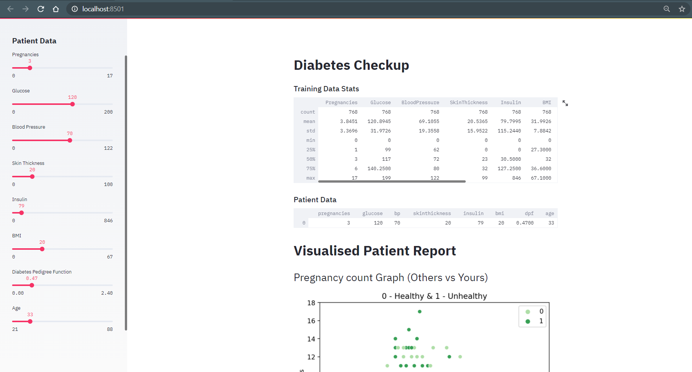

# Diabetes Prediction Model

This project is a web application that predicts the likelihood of a person having diabetes based on certain health metrics. The application is built using Python and Streamlit.

## About Diabetes Prediction

Diabetes is a chronic medical condition that affects how your body turns food into energy. Diabetes occurs when your blood sugar (glucose) levels are too high. There are several risk factors associated with diabetes, including genetics, obesity, physical inactivity, and poor diet.

Machine learning models can help predict the likelihood of a person having diabetes based on certain health metrics such as glucose level, blood pressure, BMI, and others. This web application uses a Random Forest Classifier model trained on a dataset of diabetes patients to make predictions about the likelihood of an individual having diabetes.

## Screenshots




## Getting Started

To run this web application locally on your machine, follow these steps:

1. Clone this repository to your local machine:

```bash
git clone https://github.com/AmanSagar0607/Diabetes-Prediction.git
```

2. Navigate to the project directory:

```bash
cd Diabetes-Prediction
```

3. Install the required Python dependencies:

```bash
pip install -r requirements.txt
```

4. Run the Streamlit app:

```bash
streamlit run app.py
```

5. Once the app is running, open your web browser and go to [http://localhost:8501](http://localhost:8501) to view the application.

## About Streamlit

[Streamlit](https://streamlit.io/) is an open-source Python library that makes it easy to create and share web apps for machine learning and data science projects. It allows developers to build interactive and customizable web applications directly from their Python scripts, without needing to write HTML, CSS, or JavaScript.

Streamlit provides a simple and intuitive way to create user interfaces for machine learning models, data visualizations, and other data-driven applications. With Streamlit, you can quickly prototype, iterate, and deploy web apps, making it an ideal choice for building data-centric applications like the Diabetes Prediction app in this project.

## Model Information

The web application uses a Random Forest Classifier model to predict the likelihood of an individual having diabetes. The model is trained on a dataset containing various health metrics of diabetes patients, such as glucose level, blood pressure, BMI, and others.

## Author

This project is developed by Aarchi Gandhi, Aman Sagar, Manas Kori and Ujjwal Agrawal.
